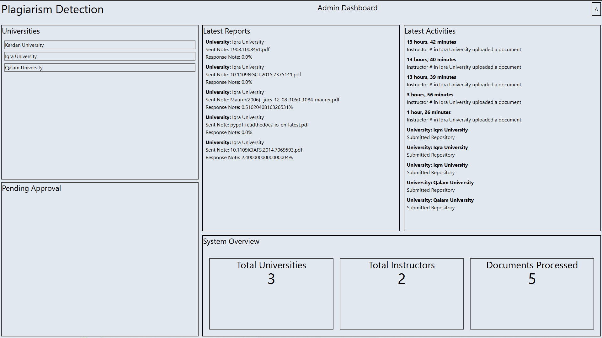
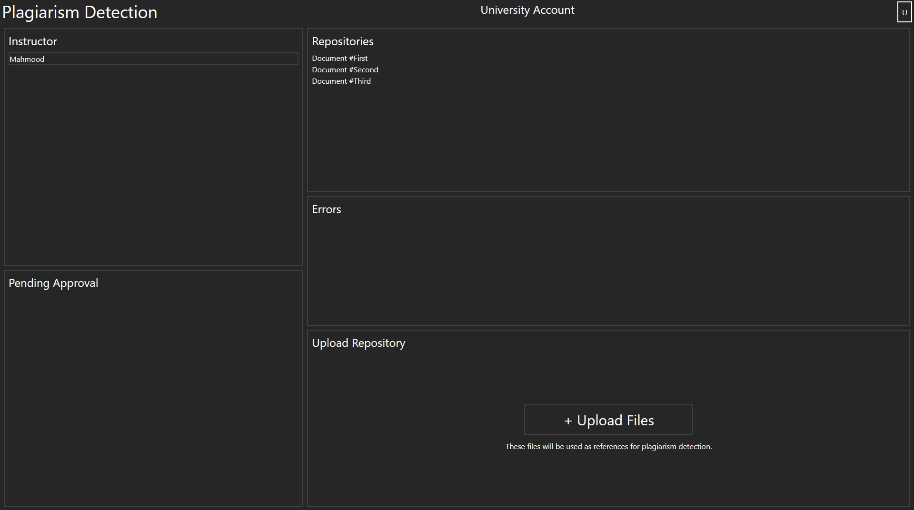
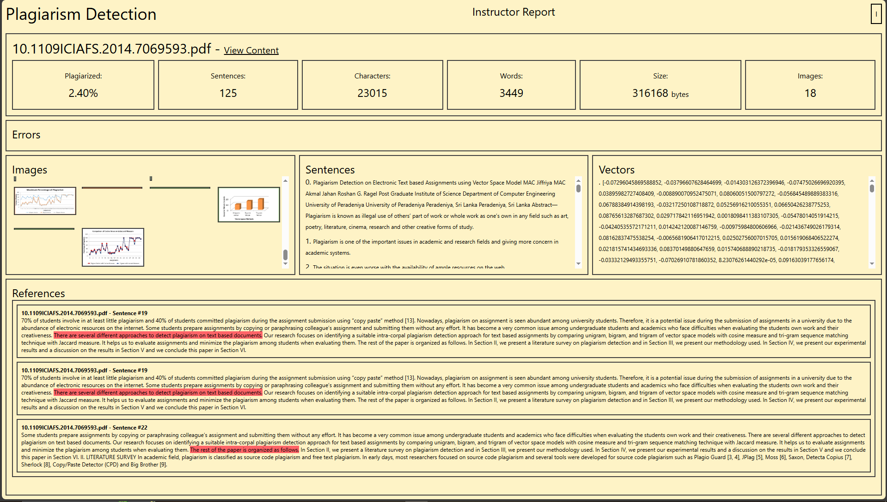
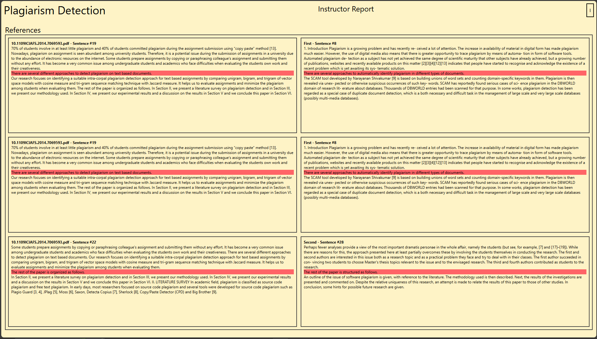

<p align="center">
 <!--  -->
 <h2 align="center">Plagiarism Detection System</h2>
 <p align="center">Helping professors efficiently detect plagiarized content from students' research projects</p>
</p>
  <!-- <p align="center"> -->
  <!--   <a href="https://github.com/username/project-name/actions"> -->
  <!--      -->
  <!--   </a> -->
  <!--   <a href="https://github.com/username/project-name/graphs/contributors"> -->
  <!--      -->
  <!--   </a> -->
  <!--   <a href="https://codecov.io/gh/username/project-name"> -->
  <!--      -->
  <!--   </a> -->
  <!--   <a href="https://github.com/username/project-name/issues"> -->
  <!--      -->
  <!--   </a> -->
  <!--   <a href="https://github.com/username/project-name/pulls"> -->
  <!--      -->
  <!--   </a> -->
  <!--   <a href="https://securityscorecards.dev/viewer/?uri=github.com/username/project-name"> -->
  <!--      -->
  <!--   </a> -->
  <!--   <br /> -->
  <!--   <br /> -->
  <!-- </p> -->


# Plagiarism Detection System

Plagiarism Detection System (PDS) is an online system built to check students' research project for plagiarized content. Designed specifically for academic institutions who have their own custom repositories. PDS can show which source or research paper it has matched and up to what percent, which we will refer to as source mapping. PDS can show live progress while checking students' research. PDS is the full solution. Academic institutions can upload their repositories and check against them.

## How to Access

Use a web browser to use PDS.

```url
# URL to website
```

## Testing

For testing the project, run this command below

```bash
python manage.py test
```

## How to use Git

1. Add file: git add <filename>
2. Document changes: git commit -m "message"
3. Upload: git push
4. Download changes: git pull

## Usage

```todo
# Include demo
```

## Contributing

Pull requests are welcome. If you notice any mistakes or errors, please open an issue first and if you have the solution, refer to [Setup Guide](docs/setup-guide.md) to setup the development environment for the project and make a pull request. For major changes, please open an issue first, too, to discuss what you would like to change.

Please make sure to update tests as appropriate.

## Authors and acknowledgment

Thanks to both my teammates [Sayed Noorullah Hashimi](https://github.com/Noor2099) and [Mohammad Helal Afzali](https://github.com/Helalafzali) for their dedicated work. This project would not have been possible without them.
We really appreciate [Professor Mohammad Tahir](https://www.researchgate.net/profile/Muhammad-Tahir-182)'s hard work for putting up with us and thoroughly reviewing our project for mistakes.

## License

[Apache License 2.0](https://choosealicense.com/licenses/apache-2.0/)

## Demo Photos







## Project Status

PDS is in its last stages of development. We are cleaning up the codebase and getting it ready for presentation.
